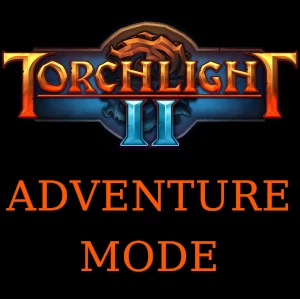

**Adventure mode** overhauls Torchlight II's map system by transforming the campaign areas and end-game maps into tiered, scaling content from level 1 to 100. Unlike other mods, it organizes maps into 16 different tiers so that players experience a well-structured sense of progression rather than simply making every scroll in the game scale to the player's level - instead, you can push your build to the limit by travelling to higher-tier maps or make your own pace casually and grind lower-level maps until you're ready to advance to the next step of your journey!

Maps can be purchased from vendors as soon as you reach the Estherian Enclave (first town hub and second overall area in the game). These scrolls don't require you to unlock or access the Mapworks, simply right-clicking them from your inventory screen will immediately open a portal you can travel through.

# Main features

* A completely overhauled, 100% viable alternate game mode
* ~20,000 individual map scrolls
* ~100 procedurally-generated areas from the base game to explore:
* 16 tiers of maps, allowing you to play at your own pace and decide your own path through the game
* 6 strategic reward types per applicable map, with a dozen subtypes for focus-farming upgrades
* Content ranging from the very early game up to max level (tier 16 scales between level 80 and 100)
* Should be compatible with every other mod that doesn't also overhaul the campaign
* Open-source

## Statistics

16 tiers generated for:
- 71 maps
- 27 bosses
- 13 wilderness
- 10 challenges
- 7 netherrealm
- 4 dungeons

6 map reward categories, 15 reward types:
- 5 for weapons (bows and crossbows; cannons, pistols and shotgonnes; staves and wands; axes, claws, maces and swords; greataxes, greathammers, greatswords and polearms)
- 3 for trinkets (belts; necklaces; rings)
- 3 for vendors (enchanters; set merchants; socketers)
- 2 for armor (boots, chest armor and pants; gloves, helms, shields and shoulder armor)
- potions
- shrines

For a total of 21,824 generated maps.

# Contact and support

For support and discussion, [join the Discord](https://discord.gg/5sXXcwPCSP)!

# Installation

**Steam workshop version:** if you own the game on Steam, simply open the [Workshop page](https://steamcommunity.com/sharedfiles/filedetails/?id=2553033153) and hit the "subscribe" button. Next time you launch the game, enable the mod as normal through the official Mod Launcher.

**Manual install:** Download the latest version of the mod file from [the GitHub release page](https://github.com/tukkek/torchlight2-AdventureMode/releases) and place it on your Torchlight 2 mod folder. If you're unsure the exact folder location, use the "Open mods folder" button on the official Mod Launcher tool. If needed, check [this video](https://www.youtube.com/watch?v=e5KeocjLUiA) for step-by-step instructions.

# Torchlite II

Check out this mod-list that Adventure Mode was custom-built for: your very own, all-in-one [Torchlight II roguelite pack](https://steamcommunity.com/sharedfiles/filedetails/?id=2553012355)! Includes other mods by both myself and the Torchlight community, featuring also quality-of-life enhancements that aim to modernize the game experience!

# Gameplay details

As with most roguelike games, you can be dealt a rougher hand early on due to the randomness, when your character is at its weakest. If you have any trouble, try sticking to Tier 1 maps until you have at least a full set of gear from the blacksmith. Also, consider trying this on Casual difficulty at first while you're still learning how this mode's progression works.

The first and last tier of map scrolls have some limited scaling, with Tier 1 scaling with player level up to level 5 and Tier 16 likewise from level 80 to 100. This is done both to ease lower-level characters into the progression system (especially important on higher difficulties) and to provide an "endgame" for players who want to push to level 100.

Since you can't find any spell vendors in this mode, a guaranteed spell drop is given with every boss and gold chest. This shouldn't impact balance too much as most spells are tuned around their mana cost and there is a hard limit to the number of spells you can have at once (even if you only go for passives). It also gives a nice incentive (and reward) to investing more time into longer dungeon and higher-risk boss maps. As a fall-back, champion monsters also have a small chance of dropping spells.

# Balance

## Difficulties

* **_Casual_ and _Normal_**: are straighforward, with _Normal_ being the default play-testing option during the mod's development.
*  **_Veteran_**: version 2.0 better supports this difficulty but even then players are advised to take some extra steps like stocking up on lower-tier maps (to fall-back to if needed) and acquiring a full set of basic gear before doing their first runs.
*  **_Elite_**: while no intentional tuning has been done for this mode, some further min-maxing and, in particular use of the shared stash would probably make this viable. Players who enjoy pre-planned builds and use of build-guides might find this option better suited for their level of optimization as well.

These requirements seem to be aligned with the spirit of _Veteran_ and _Elite_, as well as their tuning in other games of the genre. Players used to trivializing harder difficulties in the vanilla (or modded) game through extensive min-maxing may find the change significant though - however, [more mods can be used to restore that experience](https://steamcommunity.com/workshop/filedetails/discussion/2553033153/3827541651925946169/).

Balance is considered for single-player, hardcore mode, fresh and solo-self-found (no stash), using the Torchlite mod pack and its spell drops. The ultimate goal is to allow players to level to 50 in around 4-5 hours with this setup, on their prefered difficulty. Use of the pack is not necessary, as it makes no major balance changes of its own.

As with most roguelites, the first few maps can be fairly challenging, especially on higher difficulties. This happens because the players are at their weakest, with the least tools to mitigate risk. There are infinitely more ways to die early-on compared to the vanilla campaign but much playtesting has been done to ensure a smooth beginning, especially on the lower difficulties. Once players have a few levels under their belt, they can then choose their own pacing by doing higher or lower tier maps as preferred.

## Progression

Upon entering a map, a skilled player (relative to their chosen difficulty), should be able to either:

1. Sustain their map scrolls by acquiring a new map of the same tier; or
2. Progress horizontally by gaining enough experience to level-up
3. (Optionally and additionally, regain any gold spent on consumables while exploring the map)

Achieving either or both objectives assures that some progress has been made - and as importantly, that backwards progress was avoided (such as running out of maps of a given tier or being unable to afford potions for the next map). This is however, not a hard rule: drawbacks and difficulties are often what make a rogue-like run memorable!

With this in mind, version 2.0 has made every source that drops a map result in 0 to 2 maps, with some sources guaranteeing an extra one (so, for those, in practice, 1-3). On average, that means a player who can kill at least one champion per map should be able to sustain their maps, fulfilling condition #1 above.

This is relatively generous on lower difficulties (which will also enable more casual players to more freely choose the content they interact with) but necessary on higher difficulties, while also providing a steady surplus of maps that can be stashed (either for a given run or for future ones). That surplus is tuned to not be too excessive.

Map drops are always relative to player level, with each higher tier being about twice as rare as the previous one - with a lower limit imposed to higher-level drops.

In 1.0, maps could only be acquired in shops. More recently, players should be able to fully progress through drops only, with the shop serving only an auxiliary function.

# Planned features

Full list of pending tasks and known-issues available [here](https://github.com/tukkek/torchlight2-AdventureMode/issues).

# Contributing

[This mod is fully open-source](https://github.com/tukkek/torchlight2-AdventureMode)! Consider [joining the Torchmodders Discord server](http://torchmodders.com/torchmodders-discord/) too, if you want to talk shop with community veterans!

Dependencies (for development only, not required to play the mod):

* [Python 3](https://www.python.org/downloads/)
* [unix2dos](http://dos2unix.sourceforge.net/)

Extra utility scripts are written in [BASH](https://www.gnu.org/software/bash/) (may work under [Cygwin](https://www.cygwin.com/) on Windows).
